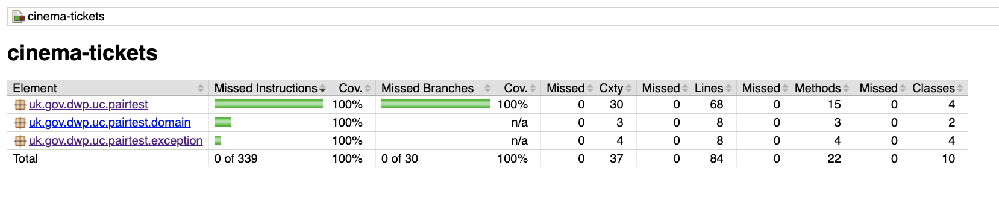
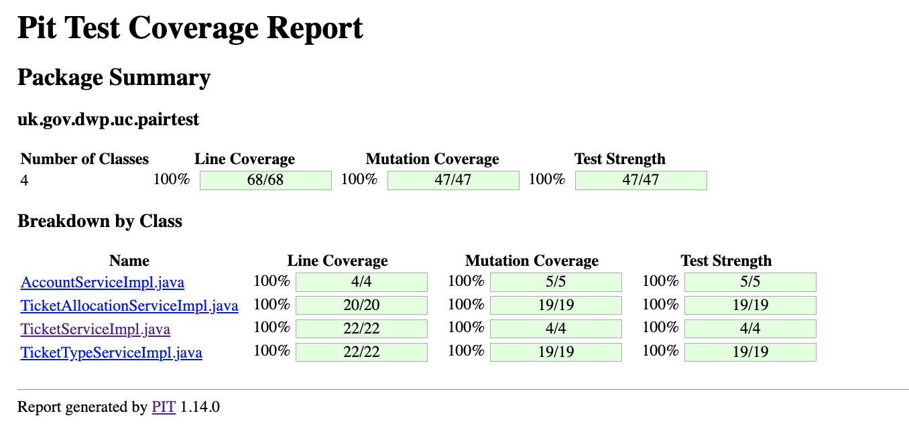

# Cinema Tickets (Java) coding challenge

A service class that handles an unknown # of Ticket Type requests to purchase cinema tickets.
There are 3 ticket types, `ADULT`, `CHILD` and `INFANT` which are assigned to each request with
a total number of tickets required for that type. Each set of requests (transaction) can have multiple
ticket type requests per type. This service validates these requests using the rules, constraints, assumptions
and my own interpretation / approach to process each request. A valid outcome will mean a successful transaction
has been made to the `Ticket payment service` and `seat reservation service`.

### Scenario outline (rules / constraints / assumptions)

See [Scenario Outline](./Readme%20-%20scenario%20outline.md) for details of this challenge.

### My approach / interpretations

#### Existing rules
- Business Rule: `Only a maximum of 20 tickets that can be purchased at a time`: I have interpreted this as the 
total number of seats requested from the whole transaction (set of ticket type requests). It could be interpreted 
that the maximum is applied per ticket type request but that is not the approach I have applied.
- Constraints: `The "TicketTypeRequest" SHOULD be an immutable object`: I have extracted the Enum into a separate class
and replaced the Java object with a Record. I am unsure if I was allowed to do this with the constraint, but I believe a Record
was the right approach for immutability purposes. Depending on the types within the Record, you can essentially mutate the state, for example
a List type, but in this instance there are no means to set / overwrite the data once the constructor has been called.


#### Own assumptions
- A maximum # of ticket type requests has been validated and set at 40. This is because given the restrictions
on the `MAX_TICKETS == 20` per transaction, I calculated that the following scenario is the maximum # ticket requests required

| # Adult Tickets | # Infant tickets  | # Child tickets | # ticket type requests | # seats reserved |                                       # description                                        |
|:---------------:|:-----------------:|:---------------:|:----------------------:|:----------------:|:------------------------------------------------------------------------------------------:|
| 20              |        20         |        0        |           40           |        20        | INFANTs do not count towards the seat allocation, but do towards the ticket type requests. |
 

- INFANT ticket requests are included in the max ticket type requests even though they do not command their own seat.
- As an INFANT is required to sit on the lap of an ADULT, you can not have more INFANTS than ADULTS.
- There is no limit to ratio of CHILD to ADULT (only restriction is MAX_TICKETS). Therefore, you could have 1 ADULT & 19 CHILD.


### My approach
- I have used `BigDecimal` for the monetary values. I recognise that the payments are taken as `int` and the values are rounded to whole numbers. However,
this is useful for whether prices change with decimals and can help with calculations. (I am not sure as to why an int has been used in the ticket payment service param)
- The Enum stores the ticket price along with the type - this could also be injected through external properties using a config file.
- Bespoke Exceptions are thrown from each individual class and re-thrown in the main class with `IndividualPaymentException` and wrapped with the cause to get the stack trace.
- The ticket types are collected into a Map of the 3 Types with the sum of each ticket.
- To be a valid Ticket type request:
  - Type must not be null
  - num tickets must be between 1 && MAX_TICKETS
- All classes (except those in the package: `thirdparty`) have been formatted with checkstyles (using google checks)
- A separate test class is used to test individual rules as per the overview, see `src/test/**pairtest/integration/TicketAllocationIT.class` - go to `BusinessRulesConstraintsAssumptionsTestCase` class. These
are duplicates of the main tests but are highlighted to specifically show the test cases against the scenario overview.
- Unit tests require Mockito and ensuring I control the flow of the requests. The Integration test in the `integration` folder allows the request to flow through the 
whole application. The only classes I use a Spy on are the external ones to validate the request has been made.


### Other factors considered
- The following I deemed not in scope:
  - There is no entry point through the application for this class.
  - The application is not dockerised.
  - There is no CI/CD file.
  - The MAX_TICKETS could be interpreted as accepting ticket type requests of 100 (as an example), and looping through the payment / seat service 5 times in chunks of 20,
however, the validation I have applied is only a maximum total of 20 tickets within the ticket type requests.
  - I have used 1 log statement at the end to summarise the seats & cost - as most statements come from exceptions - extra debug logging could be added.
  - Additionally, I have not used a logging framework to format the logs.
  
## Tests

The application comes with a number of test classes. The main class which will run through
the whole application without stubbing (except for seat reservation and payment services) using a number
of pre-configured test profiles. You can add your own profile should you wish to put through your own payload.


To run locally:

There are 120 tests in total.

```shell
# Will run the unit test classes with suffix *Test
mvn clean test  # Results in 80 tests completed and passing

# Will run the tests above and the single test suffix *IT
mvn clean verify # Results in an additional 40 tests completed and passing
```

### JaCoCo

The application has the `jacoco` plugin to help with code coverage. To view the report once the tests
have been run, open `/target/site/jacoco/index.html` in any browser to view a user-friendly GUI. Below is a screenshot
of the results:



### PITEST (Mutation tests)

The application also has the Pitest plugin to further support the robustness of the testing. Further details of this
application is [here](https://pitest.org/). To run these tests:

```shell
mvn test-compile org.pitest:pitest-maven:mutationCoverage
```

The initial run may take longer than subsequent ones as it is configured to store a history file in the `/pitest` folder.
Like jacoco, you can view the results in a user-friendly GUI. Below is an image of the results:



